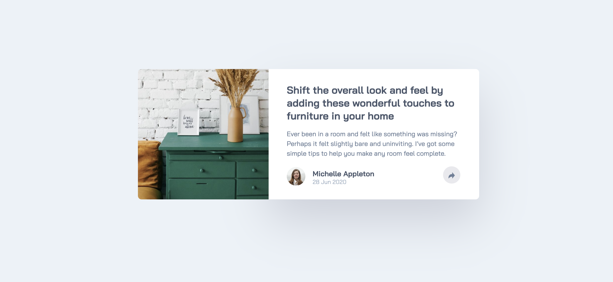

<h1 align="center">Article Preview component</h1>

 <a align="center" href="https://ctrlaltsudo.github.io/Article-preview-component/">Live Demo</a>

 <a align="center" href="https://www.frontendmentor.io/solutions/article-preview-component-OLaOjnScXX">Solution Page</a>

<h2 align="center">Project Screenshot<h2>

  </img>

## Description

This is a Frontend Mentor challenge, click the link above to visit the challenge page. 

## Built with 

HTML

CSS

Flexbox

Vanilla JS

## What I learnt 

I overcomplicated the Javascript file, I thought I needed to add lots of add class list lines when I could have just added them to a media query in my CSS, speaking of CSS I think this is the first time where I've used the relative and absolute positions.

Getting the share element pop-up on mobile to show correctly was way harder than I expected, got there eventually though! 

## Authors

<a href="https://github.com/CtrlAltSudo">CtrlAltSudo</a>.

## Acknowledgments 

Stack overflow, Google and ChatGPT still prove to be valuable resources! 